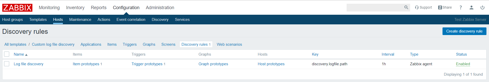
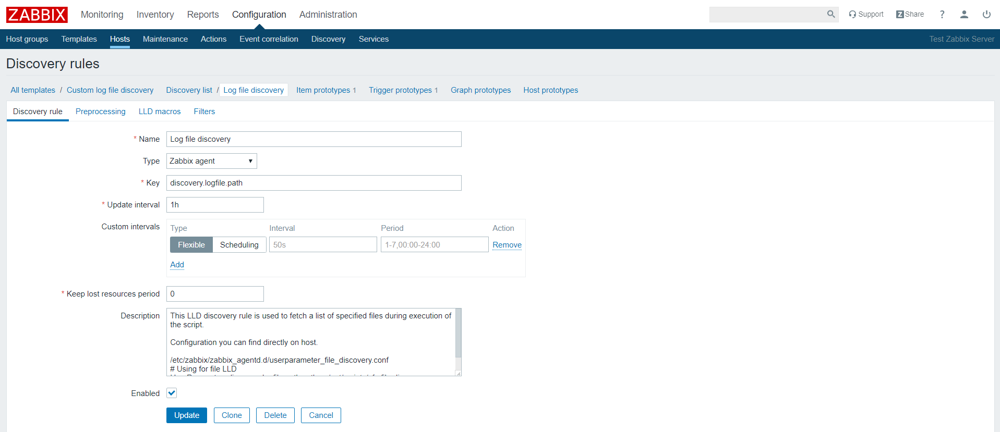
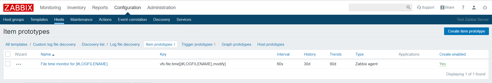
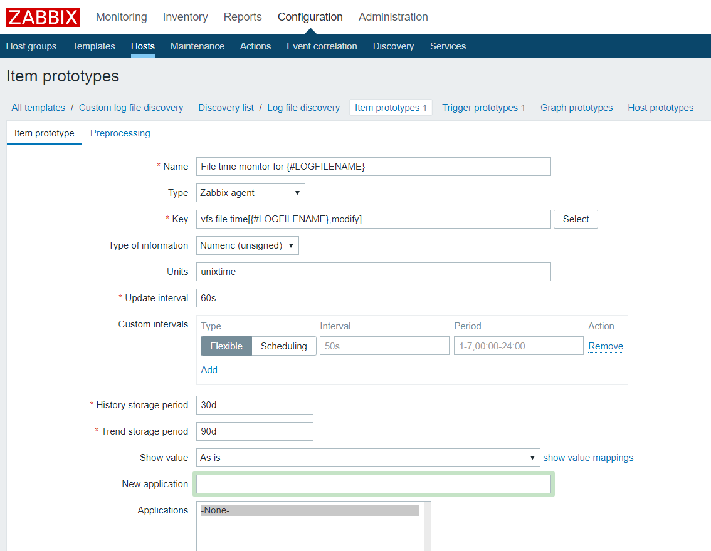
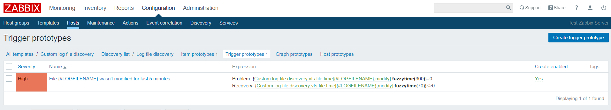
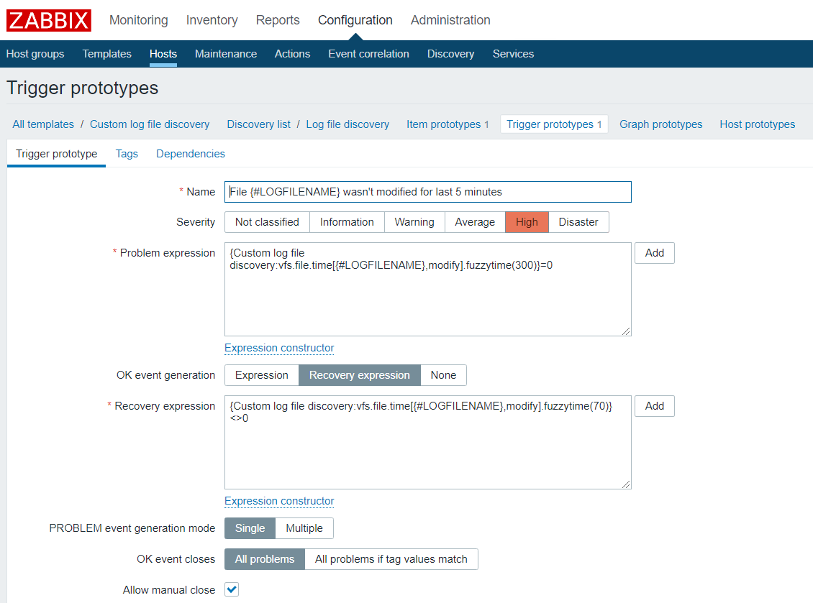

## Introduction
The low level discovery rule will return all file names with full path via `{#LOGFILENAME}`

## Installation
1. Zabbix agent should be installed and properly configured on linux server.
1. Custom script should be placed on linux server. 
   For example, `/etc/zabbix/scripts/vfs-file-discovery.py`
1. Script should be executable. 
   `# chmod +x /etc/zabbix/scripts/vfs-file-discovery.py`
1. User Parameter should be configured in a needed way. Example below. 

   User Parameter configuration you can place in some separate config file.
   ```
   [root@local2 ~]# cat /etc/zabbix/zabbix_agentd.d/userparameter_file_discovery.conf
   # Using for file LLD
   UserParameter=discovery.logfile.path,python /etc/zabbix/scripts/vfs-file-discovery.py -p "/opt/log/" -n "log[0-9]*.txt"
   ```

1. Zabbix agent should be restarted to make changes active.
   ```
   # systemctl restart zabbix-agent
   # systemctl status zabbix-agent
   ```

1. Manual testing of script and user parameter. Examples below.
   ```
   [root@local2 ~]# python /etc/zabbix/scripts/vfs-file-discovery.py
   usage: vfs-file-discovery.py [-h] -p PATH -n NAME
   vfs-file-discovery.py: error: argument -p/--path is required
   ```
   
   ```
   [root@local2 ~]# python /etc/zabbix/scripts/vfs-file-discovery.py --help
   usage: vfs-file-discovery.py [-h] -p PATH -n NAME

   Custom low-level discovery of files in a directory

   optional arguments:
     -h, --help            show this help message and exit
     -p PATH, --path PATH  Input directory path
     -n NAME, --name NAME  Input file name
   ```

   ```
   [root@local2 ~]# python /etc/zabbix/scripts/vfs-file-discovery.py -p "/opt/log/" -n "log[0-9]*.txt"
   {"data": [{"{#LOGFILENAME}": "/opt/log/log2.txt"}, {"{#LOGFILENAME}": "/opt/log/log21.txt"}, {"{#LOGFILENAME}": "/opt/log/log11.txt"}, {"{#LOGFILENAME}": "/opt/log/log1.txt"}]}
   ```
   
   ```
   [root@local2 ~]# zabbix_agentd -t discovery.logfile.path
   discovery.logfile.path                        [t|{"data": [{"{#LOGFILENAME}": "/opt/log/log2.txt"}, {"{#LOGFILENAME}": "/opt/log/log21.txt"}, {"{#LOGFILENAME}": "/opt/log/log11.txt"}, {"{#LOGFILENAME}": "/opt/log/log1.txt"}]}]
   ```
   
   So, in the end we should get json that will be parsed by zabbix.

1. Template should be imported into zabbix frontend.
   
## Screenshots from Zabbix frontend


   

   

   

   

   

   
## Notes
Custom script has been written using Python 3.7

Template were created and tested on Zabbix 4.2.4 and CentOS Linux release 7.6.1810 (Core)

